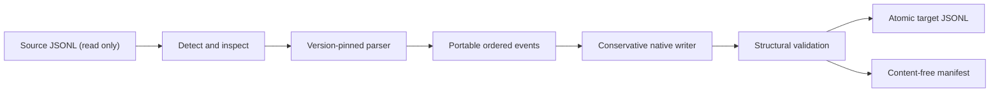

# Architecture and safety model

## Conversion pipeline



Claude Code and Codex do not publish stable interchange schemas. The bridge
therefore does not translate keys directly. Each reader first projects a native
transcript into a small, ordered intermediate representation (IR), and the target
writer then emits only shapes verified against a pinned target CLI.

The pinned integration baseline is:

- Docker image
  `sha256:8f170f660813ac358f347fa8a3580139972f3ea7a9fb087834f1da44669d9392`;
- Claude Code `2.1.209`; and
- Codex CLI `0.144.4`.

Legacy histories from other observed versions are parsed best-effort and
produce an `unvalidated_source_version` warning. Paginated/lineage-dependent
Codex histories fail closed. A target version option changes the
version recorded in native metadata; it does not change the writer schema.

## Portable event model

A `Session` holds source provenance, session metadata, and a total ordering of
`Event` values. Events represent:

- user or assistant text;
- tool calls and linked tool results;
- portable image URLs, including self-contained `data:` URLs;
- compaction summaries and boundaries;
- thinking/reasoning markers without private reasoning content;
- context records; and
- opaque events used to account for records or blocks that must not be replayed.

Every event points back to a source record ordinal and, where applicable, a
content-block ordinal and source UUID. Raw opaque records are deliberately not
copied into the manifest or target. The source-file SHA-256 and content-free
event counts provide auditability without duplicating private conversation
content.

## Claude reader and writer

Claude messages are a UUID/`parentUuid` graph rather than a flat log. The reader
uses the latest valid `last-prompt.leafUuid`, walks its ancestors through all
UUID-bearing records, and projects the active branch. Abandoned branches are
counted as opaque. A session without a usable leaf falls back to the ordered
top-level conversation records.

The writer creates a fresh, linear UUID chain. Multiple portable blocks from one
source record stay in one native message where the Claude content model allows
it; distinct source message records remain distinct. It writes synthetic but
structurally native assistant message IDs, request IDs, zero usage counters, and
the selected model label. It never copies source credentials, hooks, memory, or
global configuration.

## Codex reader and writer

The Codex reader treats `response_item` records as model-visible history.
`event_msg.user_message` and `event_msg.agent_message` are only used as a legacy
fallback when response messages are absent, which prevents UI projection events
from duplicating model context.

The writer uses legacy, non-paginated rollout history. It emits:

1. canonical `session_meta` with the generated UUID and target working
   directory;
2. `response_item` records for model-visible messages and tool interactions; and
3. matching `event_msg` projections for user/assistant text so imported sessions
   have picker previews and UI transcript entries.

It intentionally does not update `state_5.sqlite`. Codex treats that database as
a derived index: explicit UUID lookup falls back to the JSONL and performs index
repair. Avoiding direct SQLite mutation makes installation smaller and safer.

Codex `developer` and `system` messages are never converted into user prompts.
They are omitted with a manifest warning because changing their privilege level
would be a security and semantic error.

## Native installation

`convert` writes to an explicit path. `import` resolves the native target path:

```text
Claude: <home>/projects/<encoded-cwd>/<uuid>.jsonl
Codex:  <home>/sessions/YYYY/MM/DD/rollout-<timestamp>-<uuid>.jsonl
```

The source is always read-only. Output and manifest paths are collision-checked
for both dry runs and real imports. Each file is built in its destination
directory with mode `0600`, flushed, and installed with an atomic hard-link
create-if-absent operation. This avoids the time-of-check/time-of-use overwrite
race of `exists()` followed by `replace()`. If manifest installation fails after
the newly created transcript is installed, that new transcript is rolled back.

No target index is edited, so there is no index backup to manage. Existing files
are never overwritten.

## Loss accounting

The sidecar manifest records:

- bridge and source/target CLI versions;
- source and output SHA-256 digests;
- source and target session IDs;
- chosen target CWD and native path;
- source record and portable event counts;
- transformed or omitted detail counts; and
- version and path warnings.

The manifest does not contain message text, tool arguments, tool output, image
data, or raw unknown records. It does include filesystem paths and session IDs,
which may themselves be sensitive operational metadata and should remain
private.

## Trust boundary

Session files are untrusted input. The JSONL reader enforces a 64 MiB per-record
limit, rejects malformed/non-object records, and reports line numbers without
echoing record contents. Conversion never executes tools, resolves attachment
paths, fetches URLs, authenticates a CLI, or contacts a model endpoint.

Image conversion rewrites only source wrappers: Claude base64 sources become
`data:` URLs and vice versa. The bridge does not decode or inspect the payload.
Standalone attachment records, audio, sidechains, source sandbox state, and
private reasoning are not replayed in v0.1.
