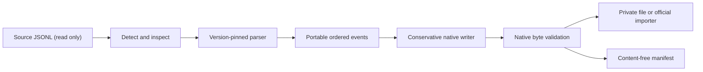

# Architecture and safety model

## Conversion pipeline



Claude Code, Codex, and Pi do not publish a shared interchange schema. The migrator
therefore does not translate keys directly. Each reader first projects a native
transcript into a small, ordered intermediate representation (IR), and the target
writer then emits only shapes verified against a pinned target CLI.

## Catalog boundary

The optional SQLite catalog is deliberately outside the neutral conversion
model. A streaming metadata scanner inventories every JSONL in configured
native roots and records only identity, lifecycle, schema/status hints, native
title/name fields, and stat metadata. Unsupported or malformed files therefore
remain searchable without being accepted by a conversion reader.

JSONL discovery is authoritative. Codex `state_*.sqlite` is opened read-only
only to enrich thread `name`, `title`, and spawn lineage; its thread table can
lag the rollout filesystem. Claude nested sidechains are cataloged as separate
unsupported physical entries with their parent/native-agent identity. Pi v3
workspace buckets are enumerated directly; no derived picker database is used.

The persistent cache key is root plus relative path. Incremental validity is
device/inode/size/mtime-ns; transfer never relies on it and repeats the normal
source snapshot and adapter validation. See the
[catalog guide](session-catalog.md) for the schema contract and privacy model.

The pinned integration baseline is:

- Docker image
  `sha256:8f170f660813ac358f347fa8a3580139972f3ea7a9fb087834f1da44669d9392`;
- Claude Code `2.1.209`;
- Codex CLI `0.144.4`; and
- Pi `0.80.6` v3.

The additional native target contracts are Pi `0.80.6` v3 JSONL, OpenCode
`1.17.20` public import bundles, and GitHub Copilot CLI `1.0.70` public session
events. Antigravity `1.1.14` and Cursor have no supported arbitrary transcript
importer and are rejected before serialization.

Legacy histories from other observed versions are parsed best-effort and
produce an `unvalidated_source_version` warning. Paginated/lineage-dependent
Codex histories fail closed. Replacement-history checkpoints use an explicit
expanded-transcript policy because their provider-encrypted state is not
portable. A target version option changes the version recorded in native
metadata; it does not change the writer schema.

## Portable event model

A `Session` holds source provenance, session metadata, and a total ordering of
`Event` values. Events represent:

- user or assistant text;
- tool calls and linked tool results;
- portable image URLs, including self-contained `data:` URLs;
- compaction summaries and boundaries;
- thinking/reasoning markers without private reasoning content;
- context records; and
- opaque events used to account for records or blocks that must not be replayed.

Every event points back to a source record ordinal and, where applicable, a
content-block ordinal and source UUID. Raw opaque records are deliberately not
copied into the manifest or target. The source-file SHA-256 and content-free
event counts provide auditability without duplicating private conversation
content.

## Claude reader and writer

Claude messages are a UUID/`parentUuid` graph rather than a flat log. The reader
uses the latest valid `last-prompt.leafUuid`, walks its ancestors through all
UUID-bearing records, reverses that ancestry, and emits semantic graph order
rather than physical file order. This matters because streamed tool-result
children can be written before their tool-call parents. Abandoned branches are
counted as opaque. A session without a usable leaf falls back to the ordered
top-level conversation records. The reader also recognizes one narrowly
validated, metadata-declared preserved-segment back-edge used by Claude
compaction; every other ancestry cycle fails closed. `isMeta: true` ancestors
remain graph links but become opaque omissions, so Claude-internal caveats and
reminders cannot be promoted into target user prompts.

The writer creates a fresh, linear UUID chain. Multiple portable blocks from one
source record stay in one native message where the Claude content model allows
it; distinct source message records remain distinct. It writes synthetic but
structurally native assistant message IDs, request IDs, zero usage counters, and
the selected model label. It never copies external authentication stores,
hooks, memory, or global configuration.

## Codex reader and writer

The Codex reader treats `response_item` records as model-visible history.
`event_msg.user_message` and `event_msg.agent_message` are deduplicated against
canonical messages and can supply legacy fallback history when response items
are absent. In mixed partial rollouts, an unmatched UI projection is retained
as explicitly marked assistant/user history and reported as
`message:ui_only_projection`; fuzzy or substring matching is never used.

A modern `compacted.replacement_history` replaces Codex's effective model
history with user/developer messages plus provider-encrypted compaction state.
Claude cannot consume that encrypted state. For cross-provider continuity, the
reader therefore retains the visible response-item transcript that precedes
the checkpoint and marks the compaction as
`replacement_history_expanded`. The Claude writer omits the undecodable state,
while the manifest explains that the transferred context is an expanded view,
not Codex's exact post-compaction context. A paired
`event_msg.context_compacted` UI notification is deduplicated against the
canonical compaction checkpoint.

The writer uses legacy, non-paginated rollout history. It emits:

1. canonical `session_meta` with the generated UUID and target working
   directory;
2. `response_item` records for model-visible messages and tool interactions; and
3. matching `event_msg` projections for user/assistant text so imported sessions
   have picker previews and UI transcript entries.

It intentionally does not update `state_5.sqlite`. Codex treats that database as
a derived index: explicit UUID lookup falls back to the JSONL and performs index
repair. Avoiding direct SQLite mutation makes installation smaller and safer.

Codex `developer` and `system` messages are never converted into user prompts.
They are omitted with a manifest warning because changing their privilege level
would be a security and semantic error.

## Pi reader and writer; OpenCode and Copilot writers

The Pi reader validates a v3 session header, builds the `id`/`parentId` entry
tree, selects the active leaf, and emits that ancestry in semantic order.
User/assistant/tool-result messages, assistant tool calls, inline images,
compaction summaries, session names, provider/model labels, and timestamps map
to the portable model. Abandoned branches and runtime-only entries are retained
only as content-free accounting events. The same-format Pi-to-Pi path is
rejected; Pi can be the source for every other supported target.

Pi output is an append-only v3 JSONL session with one linear parent chain. It
preserves portable text, images, tools/results, compaction summaries, and a
session name. The native validator requires at least one context-bearing entry;
`import --to pi` publishes a private file below `PI_CODING_AGENT_DIR` (normally
`~/.pi/agent`) using Pi's project-relative discovery path.

OpenCode output is its public JSON import bundle, not SQLite. Message and part
IDs follow the pinned 48-bit logical-millisecond/counter layout. The writer
advances the logical millisecond after 4,096 IDs and makes message
`time.created` nondecreasing, because OpenCode pages runtime history by creation
time and ID. Any source timestamp adjustment is counted as
`timestamp:native_order_adjusted`. The validator requires real portable parts,
strict message-ID order, and nondecreasing runtime timestamps.

OpenCode installation is a controlled external transaction: verify exact CLI
version, list sessions through the public CLI, reserve a private manifest path,
write a mode-`0600` bundle inside a mode-`0700` temporary directory, invoke
`opencode import ... --pure`, verify the imported ID by listing again, publish
the content-free manifest, and delete the bundle. Failure after the importer
returns warns that the native session may already exist.

Copilot output is a public-schema `events.jsonl` with a linear UUIDv4 parent
chain. Portable user/assistant messages, calls/results, and compaction summaries
map to their dedicated native event types. Validated images become
content-addressed `session.binary_asset` records; references are checked against
their SHA-256, MIME type, and decoded length before publication. The full native
import also writes a small `workspace.yaml`. It never writes Copilot's derived
SQLite session store; an exact UUID cold resume rebuilds that projection from
the event log. Tool-result image bytes remain exact in the native store, while
their model replay is provider-dependent and therefore warned.

Antigravity's observed per-conversation SQLite contains private protobuf
trajectory blobs. Its CLI and public SDK resume only harness-created histories
and expose no arbitrary-history seed. The migrator rejects the target rather than
synthesizing a fragile database. Cursor is rejected for the same import-contract
reason with its own precise error.

## Native installation

`convert` writes to an explicit path. `import` resolves the native target path,
and `transfer` first discovers a source transcript by UUID and then uses the
same import pipeline:

```text
Claude: <home>/projects/<encoded-cwd>/<uuid>.jsonl
Codex:  <home>/sessions/YYYY/MM/DD/rollout-<timestamp>-<uuid>.jsonl
Pi:     <home>/sessions/--<encoded-cwd>--/<timestamp>_<uuid>.jsonl
OpenCode: official `opencode import` (native location owned by OpenCode)
Copilot: <home>/session-state/<uuid>/{events.jsonl,workspace.yaml}
```

The source is always read-only. Its device, inode, byte size, and nanosecond
modification time are captured before detection and checked after parsing and
hashing; a live append or replacement fails with a retry instruction instead
of mixing two snapshots. Output and manifest paths are collision-checked
for both dry runs and real imports. Each file is built in its destination
directory with mode `0600`, flushed, and installed with an atomic hard-link
create-if-absent operation. This avoids the time-of-check/time-of-use overwrite
race of `exists()` followed by `replace()`. If manifest installation fails after
the newly created transcript is installed, that new transcript is rolled back.

No target index is edited directly. OpenCode's official importer owns its
database mutation. Existing files/sessions are never intentionally overwritten.

## Loss accounting

The sidecar manifest records:

- migrator and source/target CLI versions;
- source and output SHA-256 digests;
- source and target session IDs;
- chosen target CWD and native path;
- source record and portable event counts;
- transformed or omitted detail counts; and
- version and path warnings.

The manifest does not contain message text, tool arguments, tool output, image
data, or raw unknown records. It does include filesystem paths and session IDs,
which may themselves be sensitive operational metadata and should remain
private.

The target transcript has the opposite privacy property: its purpose is to
carry supported message text, tool arguments/results, and images. The migrator
does not redact, secret-scan, or encrypt those values. External authentication
stores stay outside conversion, but a secret embedded in portable conversation
content is copied and the target must be protected like the source. New
directories are private; existing directory permissions are left unchanged.

## Trust boundary

Session files are untrusted input. The JSONL reader enforces 64 MiB per-record,
256 MiB total-file, and 100,000-record default limits, rejects
malformed/non-object records, and reports line numbers without echoing record
contents. Conversion never executes tools, resolves attachment
paths, fetches URLs, authenticates a CLI, or contacts a model endpoint.

Image conversion rewrites only source wrappers: Claude base64 sources become
`data:` URLs and vice versa. The migrator checks media type, URL scheme, and
base64 syntax but does not decode or fetch the payload.
Standalone attachment records, audio, sidechains, source sandbox state, and
private reasoning are not replayed in the supported compatibility scope.
